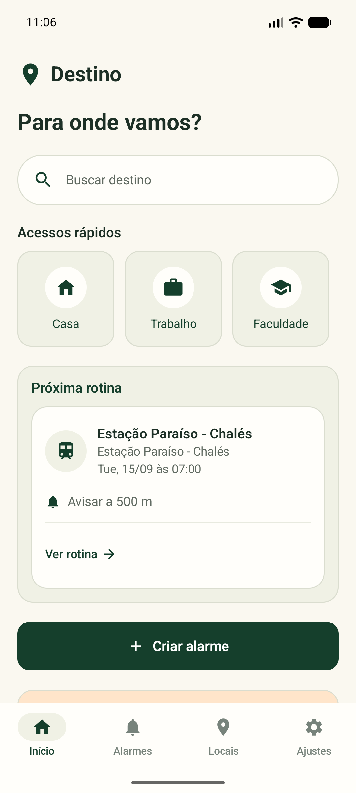
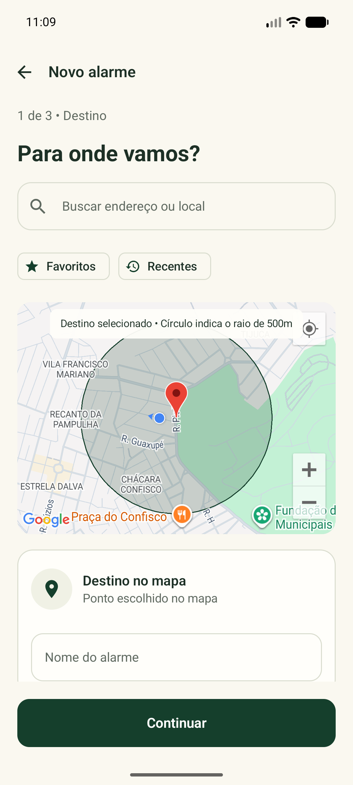
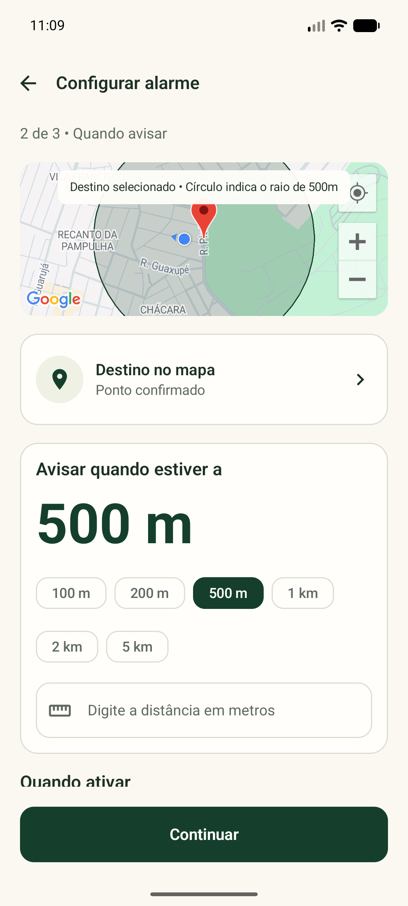
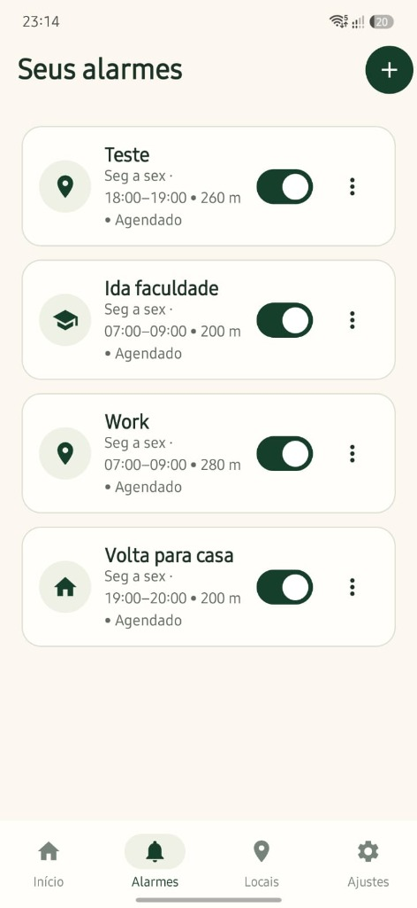
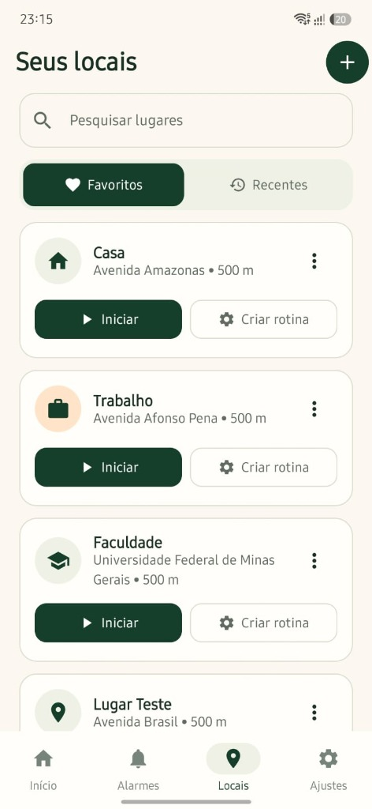
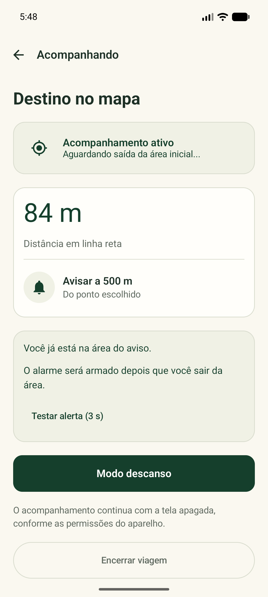
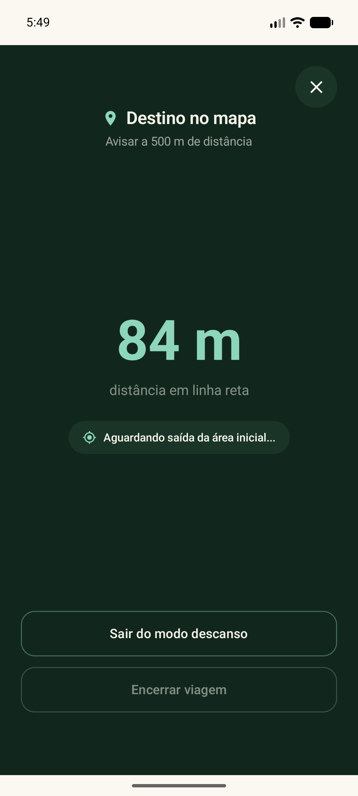

# DespertAqui 📍⏰

<p align="center">
  
</p>

> **Alarme inteligente por proximidade para Android.** Escolha seu destino, guarde o celular e relaxe — o app te acorda com som e vibração exatamente quando você estiver chegando.

---

### 📲 Quer apenas testar o aplicativo? (Instalação em 1 minuto)

Se você veio pelo **LinkedIn** e quer testar no seu celular Android sem complicação:

1. **[👉 Clique aqui para baixar o APK direto no celular](https://github.com/Ticgabriel/DespertAqui/releases/download/v1.0.0/DespertAqui-v1.0.0.apk)** *(arquivo de ~16 MB)*
2. Ao terminar o download, abra o arquivo pela barra de notificações.
3. Se o Android perguntar sobre permissão para instalar aplicativos do navegador, selecione **"Permitir desta fonte"** *(procedimento padrão para apps instalados fora da Google Play Store)*.
4. Toque em **Instalar**, abra o app e conceda a permissão de localização. Pronto!

---

## 📸 Conheça o Aplicativo

| 🏠 Início & Próximas Viagens | 🗺️ Escolha do Destino no Mapa | 📏 Ajuste Preciso do Raio |
|:---:|:---:|:---:|
|  |  |  |
| *Acesso rápido aos favoritos e rotinas do dia.* | *Busca por endereço ou toque direto no mapa.* | *Defina a distância em metros para despertar.* |

| ⏰ Seus Alarmes Agendados | 📍 Seus Locais & Favoritos |
|:---:|:---:|
|  |  |
| *Rotinas automáticas de segunda a sexta com ativação por horário e raio.* | *Atalhos rápidos para Casa, Trabalho, Faculdade e destinos frequentes.* |

| 🧭 Acompanhamento ao Vivo | 🌙 Modo Descanso (OLED) |
|:---:|:---:|
|  |  |
| *Distância em tempo real e status do sinal GPS.* | *Visual minimalista escuro para cochilar em paz.* |

---

## 🎯 O Problema que Resolve

Quem pega ônibus, trem, metrô ou viaja de carona conhece o receio diário de **dar aquela pescada e passar do ponto de descida**. 

Apps tradicionais como Google Maps ou Waze focam em navegação curva a curva para motoristas, consumindo bateria de forma agressiva com a tela ligada. O **DespertAqui** foi desenhado especificamente para o passageiro:
- Você define o destino e a que distância quer ser acordado (ex: 400 metros antes).
- Guarda o celular no bolso ou fecha a tela.
- O motor inteligente cuida do trajeto e dispara um **alarme sonoro e vibratório** no momento exato.

---

## ✨ Funcionalidades Principais

* **Busca Flexível:** Pesquisa inteligente de endereços/locais, seleção visual tocando direto no mapa ou entrada manual de coordenadas (Latitude e Longitude).
* **Raio Configurável:** Escolha distâncias pré-definidas (200m, 500m, 1km) ou defina qualquer valor personalizado acima de 100m.
* **Modo Descanso:** Tela com tema escuro profundo e baixo consumo energético, exibindo apenas a distância em linha reta diminuindo em tempo real.
* **Agendamento Semanal:** Crie rotinas para dias específicos da semana (ex: trabalho de seg a sex) com janelas horárias inteligentes (inclusive aquelas que cruzam a meia-noite).
* **Alertas Resilientes:** Sistema sonoro e vibratório projetado para acordar. Conta com política configurável para fones de ouvido (toca no fone ou força o alto-falante caso o fone caia).
* **Alerta Preventivo de Precaução:** Se o sinal GPS degradar ou sumir nas proximidades da sua parada, o app emite um aviso preventivo para você não ser pego de surpresa.
* **Biblioteca de Locais:** Salve casa, trabalho ou faculdade como favoritos e inicie a viagem com um único toque.

---

## 🧠 Engenharia & Arquitetura Técnica

O projeto foi estruturado seguindo as melhores práticas modernas de desenvolvimento Android nativo:

### 🔋 Polling Adaptativo de Bateria (Smart Polling)
Manter o GPS em alta frequência durante todo o percurso esgota a bateria do aparelho. O algoritmo de monitoramento do DespertAqui calcula o nível de urgência com base na velocidade e distância restante:
- **Distante do destino:** Intervalos longos e econômicos (20s a 45s).
- **Em aproximação:** Acelera as amostragens progressivamente (4s a 1s).

### 🛡️ Filtros Anti-Ruído e Confirmação Dupla
- **Dupla confirmação temporal:** Exige leituras consistentes dentro da janela de tolerância antes de deflagrar o alarme, prevenindo disparos falsos causados por imprecisão temporária de GPS.
- **Filtro de teletransporte (Jump Filter):** Descarta medições com velocidades fisicamente implausíveis (saltos instantâneos acima de 360 km/h).

### 🛠️ Stack Tecnológica
- **Linguagem:** Kotlin 100%
- **Interface:** Jetpack Compose + Material Design 3
- **Arquitetura:** Clean Architecture / MVI-like StateFlows + ViewModels
- **Persistência Local:** Room Database (com suporte a migrações) + DataStore Preferences
- **Serviços em Segundo Plano:** Foreground Service com notificações persistentes e sincronização via FusedLocationProviderClient
- **Mapas & Lugares:** Google Maps SDK for Android & Google Places API
- **Testes Unitários:** Mais de 30 testes automatizados cobrindo lógica do motor de rastreamento, cálculo geodésico de Haversine e políticas de alarme.

---

## 💻 Para Desenvolvedores (Build Local)

Se você é desenvolvedor e deseja compilar o código na sua máquina:

1. Clone o repositório:
   ```bash
   git clone https://github.com/Ticgabriel/DespertAqui.git
   ```
2. Abra o projeto no **Android Studio** (Recomendado Ladybug ou superior com JDK 17).
3. Crie o arquivo `local.properties` na raiz baseado no `local.properties.example`:
   ```properties
   sdk.dir=C:\\Users\\SEU_USUARIO\\AppData\\Local\\Android\\Sdk
   MAPS_API_KEY=SUA_CHAVE_GOOGLE_MAPS
   ```
4. Execute os testes unitários pelo terminal:
   ```powershell
   .\gradlew.bat testDebugUnitTest
   ```

---

## 📄 Licença

Este projeto é disponibilizado sob a licença [MIT](LICENSE) — livre para estudo, modificações e contribuições.
